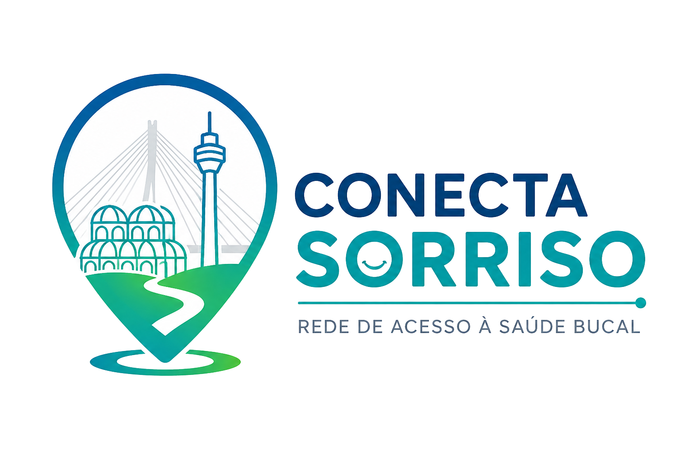

# Conecta Sorriso — Rede de Acesso à Saúde Bucal



Aplicação web responsiva que reúne e organiza informações sobre serviços odontológicos de Curitiba, com foco em reabilitação oral e próteses dentárias.

O projeto foi desenvolvido no Colégio Estadual do Paraná para o **2º Desafio da Educação Profissional e Tecnológica do Paraná (EPT-PR)**, integrando conhecimentos dos cursos técnicos em **Prótese Dentária** e **Desenvolvimento de Sistemas**.

> **Aviso:** o Conecta Sorriso é um protótipo educacional de orientação. Horários, vagas, critérios, valores e formas de acesso podem mudar. Confirme as informações diretamente com a instituição antes de se deslocar.

## Acesse o projeto

- Aplicação publicada: [Conecta Sorriso](https://gabrielbordignon.github.io/Conecta-Sorriso-ProjetoEPT-PD-CEP-2026/)
- Instituição: [Colégio Estadual do Paraná](https://www.cep.pr.gov.br/)

## Problema abordado

As informações sobre Centros de Especialidades Odontológicas e clínicas-escola estão distribuídas entre portais públicos, sites institucionais e diferentes canais de atendimento. Essa dispersão dificulta que pacientes, familiares e profissionais descubram onde há atendimento para reabilitação oral, quais são os critérios de acesso e como entrar em contato.

O Conecta Sorriso transforma essas informações em uma consulta única, simples, visual e georreferenciada.

## Objetivo

Facilitar o acesso da população a informações organizadas sobre serviços de saúde bucal relacionados à reabilitação oral com próteses dentárias em Curitiba.

O protótipo procura:

- localizar clínicas e serviços odontológicos;
- apresentar os resultados em lista e mapa;
- ordenar as instituições por proximidade;
- informar endereço, telefone, horário e forma de acesso;
- explicar a necessidade de encaminhamento e agendamento;
- reduzir barreiras informacionais entre a população e os serviços disponíveis.

## Público-alvo

- pessoas em busca de próteses dentárias e reabilitação oral;
- pessoas idosas, familiares e cuidadores;
- agentes comunitários de saúde e cirurgiões-dentistas;
- técnicos em prótese dentária e estudantes da área da saúde;
- instituições de ensino e serviços odontológicos.

## Funcionalidades

- pesquisa por instituição, bairro, categoria, atendimento e forma de acesso;
- reconhecimento de CEP com oito dígitos, com ou sem pontuação;
- localização de endereço ou CEP e ordenação das clínicas mais próximas;
- geolocalização opcional pelo navegador;
- cálculo de distância geográfica pela fórmula de Haversine;
- filtros combináveis por categoria, bairro, atendimento e encaminhamento;
- mapa interativo com marcadores e enquadramento automático;
- página individual com informações detalhadas de cada instituição;
- links para ligação telefônica, site oficial e rota externa;
- visualização responsiva para computador, tablet e celular;
- mensagens amigáveis para erros de busca, mapa, dados e geolocalização.

## Tecnologias

O projeto utiliza tecnologias abertas e gratuitas:

| Camada | Tecnologia | Finalidade |
| --- | --- | --- |
| Interface | HTML5 | Estrutura semântica das páginas |
| Estilos | CSS3 | Layout, responsividade e acessibilidade |
| Comportamento | JavaScript ES6+ | Busca, filtros, geolocalização e interface |
| Mapa | Leaflet.js | Exibição e controle do mapa interativo |
| Cartografia | OpenStreetMap | Camada cartográfica aberta |
| Dados | JSON | Armazenamento dos registros institucionais |

Não são utilizados React, Vue, Angular, Bootstrap, Tailwind, Firebase, banco SQL, Google Maps ou APIs pagas no funcionamento da aplicação.

## Como funciona a busca por proximidade

1. O usuário informa uma rua, endereço ou CEP, ou autoriza a localização do dispositivo.
2. O endereço é transformado temporariamente em coordenadas geográficas.
3. A aplicação calcula a distância entre o ponto pesquisado e cada instituição usando a fórmula de Haversine.
4. Os resultados são ordenados do mais próximo para o mais distante.
5. O mapa enquadra o local pesquisado e as instituições encontradas.

As coordenadas informadas pelo usuário são utilizadas somente durante a consulta e não são gravadas no arquivo JSON, em cookies ou em armazenamento local.

## Base de dados

Os registros ficam em [`dados/instituicoes.json`](dados/instituicoes.json). A versão atual reúne nove instituições de ensino com atendimento odontológico em Curitiba:

1. UFPR — Curso de Odontologia;
2. PUCPR — Clínica de Odontologia;
3. Centro de Especialidades Odontológicas Positivo;
4. Universidade Tuiuti do Paraná — Clínica de Odontologia;
5. UniBrasil — Centro Universitário;
6. Faculdade Herrero — Clínica de Odontologia;
7. UniCuritiba — Centro Universitário;
8. UniDomBosco — Centro Universitário;
9. UniOpet Centro Universitário.

As informações foram organizadas a partir do levantamento do projeto e dos sites institucionais indicados em cada registro. O banco contém nome, categoria, endereço, bairro, CEP, coordenadas, telefone, site, horário, atendimento, forma de acesso, observações, fonte e data de validação.

## Estrutura de pastas

```text
conecta-sorriso/
├── index.html
├── resultados.html
├── detalhes.html
├── README.md
├── css/
│   ├── style.css
│   ├── responsive.css
│   └── accessibility.css
├── js/
│   ├── app.js
│   ├── resultados.js
│   ├── detalhes.js
│   ├── mapa.js
│   ├── filtros.js
│   └── acessibilidade.js
├── dados/
│   └── instituicoes.json
└── assets/
    ├── logo.png
    ├── icons/
    └── vendor/
        └── leaflet/
```

## Responsabilidade dos arquivos JavaScript

| Arquivo | Responsabilidade |
| --- | --- |
| `app.js` | Funções compartilhadas, leitura e validação do JSON, normalização de texto, CEP, geocodificação e Haversine |
| `resultados.js` | Estado da pesquisa, renderização dos cartões, proximidade e integração entre busca, filtros e mapa |
| `detalhes.js` | Carregamento e apresentação da instituição selecionada |
| `mapa.js` | Inicialização do Leaflet, marcadores, pop-ups, enquadramento e redimensionamento |
| `filtros.js` | Aplicação conjunta dos filtros |
| `acessibilidade.js` | Tamanho do texto, alto contraste e navegação móvel |

## Como executar localmente

O `fetch()` usado para carregar o JSON pode ser bloqueado quando `index.html` é aberto diretamente pelo protocolo `file://`. Execute a aplicação por um servidor local.

### Opção 1 — Live Server

1. Abra a pasta `conecta-sorriso` no Visual Studio Code.
2. Instale a extensão **Live Server**.
3. Clique com o botão direito sobre `index.html`.
4. Selecione **Open with Live Server**.

### Opção 2 — Python

No terminal, dentro da pasta do projeto, execute:

```bash
python -m http.server 8000
```

Depois acesse [http://localhost:8000](http://localhost:8000).

O mapa e a localização de endereços precisam de conexão com a internet.

## Acessibilidade

O protótipo inclui:

- HTML semântico e rótulos associados aos campos;
- link “Ir para o conteúdo principal”;
- navegação por teclado;
- foco visível;
- áreas clicáveis confortáveis;
- mensagens dinâmicas com `aria-live`;
- controles para aumentar e reduzir o texto;
- modo de alto contraste;
- layout adaptável a diferentes tamanhos de tela;
- compatibilidade básica com leitores de tela e zoom do navegador.

## Privacidade

O Conecta Sorriso foi planejado com privacidade por padrão:

- não exige login ou cadastro;
- não solicita nome, e-mail ou dados de saúde do usuário;
- não utiliza cookies de rastreamento;
- não utiliza ferramentas de análise comportamental;
- trabalha somente com informações institucionais públicas;
- não armazena CEP, endereço ou geolocalização pesquisados;
- mantém a localização apenas em memória durante a sessão.

## Limitações

- o protótipo depende da atualização periódica das informações institucionais;
- a disponibilidade de atendimento e vagas não é consultada em tempo real;
- a distância exibida é geográfica, não o tempo real de deslocamento;
- a localização de CEP e endereço depende de serviços públicos externos;
- a aplicação não substitui orientação clínica ou confirmação da instituição.

## Melhorias futuras

- processo periódico de revisão e histórico de alterações;
- filtros por gratuidade, faixa etária, distância e disponibilidade;
- painel administrativo seguro para atualização das instituições;
- compartilhamento e impressão acessível da ficha do atendimento;
- estimativa de rota e tempo de deslocamento;
- testes automatizados de interface e acessibilidade;
- versão instalável como Progressive Web App (PWA);
- expansão para outros municípios e serviços de saúde bucal.

## Fontes e fundamentação

O README foi elaborado com base no documento **“Conecta Sorriso: Rede de Acesso à Saúde Bucal — 2º Desafio da EPT-PR”**, no levantamento institucional das clínicas e na implementação atual do protótipo.

Entre as referências que fundamentam o projeto estão:

- BRASIL. Ministério da Saúde. *Pesquisa Nacional de Saúde Bucal: SB Brasil 2010 — resultados principais*. Brasília, 2012.
- BRASIL. Ministério da Saúde. *Estratégia de Saúde Digital para o Brasil 2020–2028*. Brasília, 2020.
- BRASIL. Lei nº 13.709, de 14 de agosto de 2018. Lei Geral de Proteção de Dados Pessoais — LGPD.
- DAMASCENO, K. S. M. et al. *Acessibilidade aos serviços odontológicos no SUS: revisão da literatura*. Research, Society and Development, 2021.
- PERES, M. A. et al. *Perda dentária no Brasil: análise da Pesquisa Nacional de Saúde Bucal 2010*. Revista de Saúde Pública, 2013.
- RIBEIRO, C. G. et al. *Edentulism, severe tooth loss and lack of functional dentition in elders*. Brazilian Dental Journal, 2016.
- [Leaflet](https://leafletjs.com/).
- [OpenStreetMap](https://www.openstreetmap.org/).
- [Cadastro Nacional de Estabelecimentos de Saúde — CNES](https://cnes.datasus.gov.br/).

## Créditos

Projeto interdisciplinar do **Colégio Estadual do Paraná**, desenvolvido em 2026 para o **2º Desafio da EPT-PR**, nas áreas de Saúde Bucal, Tecnologia da Informação e Inovação em Saúde.

### Equipe estudantil

- Giovana Antonia Leme da Silva — Técnico em Prótese Dentária;
- Rafael Bittencourt Martins — Técnico em Prótese Dentária;
- Gabriel Bordignon — Técnico em Desenvolvimento de Sistemas.

### Orientação

- João Paulo Stanislovicz Prohny.

## Licença e uso

Protótipo educacional. Antes de reutilizar ou redistribuir o código, os dados ou a identidade visual, defina uma licença no repositório e confirme as autorizações necessárias para uso da marca e das informações institucionais.
